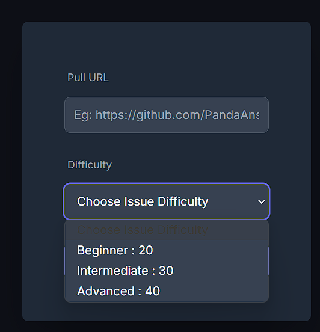
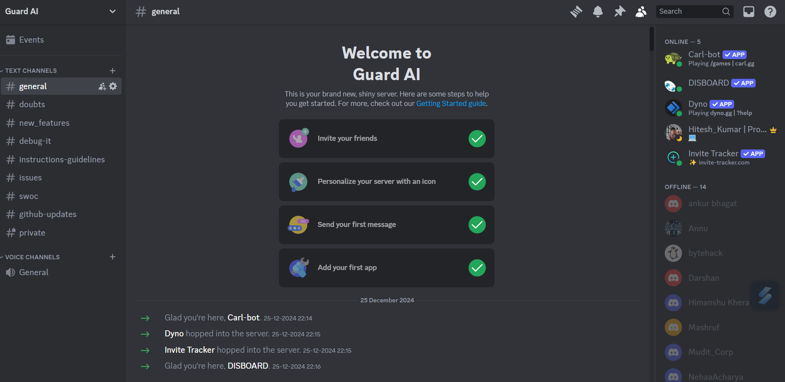
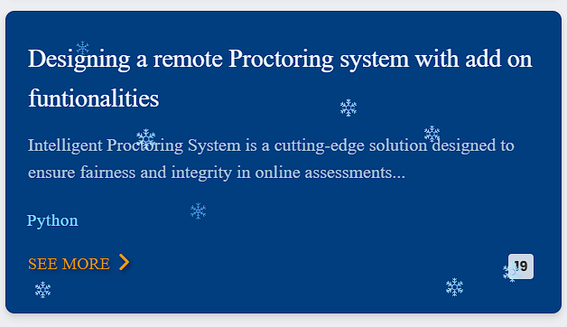

<div style="display: flex; align-items: center; justify-content: center; padding: 20px; background-color: #1e1e2f; color: white; height: 150px;">
    <h2>🎉 Transforming Remote Assessments with AI!!! 🎉</h2>
</div>

# AI-Based Proctoring System for Secure Assessments 🔒

## 📄 Provide Your Feedback or Participate

We value your feedback! Please take a moment to fill out the Google Form and contribute to improving our project.

[📋 Google Form - Participate Now!](https://docs.google.com/forms/d/e/1FAIpQLSdqqOSG82asLvwYaL6YfR35y2m6t_x_j7SHeS3W4636mzM-oQ/viewform?usp=dialog)

---

## 🌟 Overview

This project introduces a cutting-edge **AI-powered proctoring system** designed to maintain **fairness**, **security**, and **integrity** in remote assessments. By leveraging advanced machine learning techniques, this system redefines how online tests are monitored.

---

## 🚀 SWOC Program Overview

**SWOC** (Social Winter of Code) is a mentorship and open-source contribution program aimed at helping contributors enhance their skills and gain experience while contributing to real-world projects. It focuses on four key components:

### Strengths
- **Mentorship**: SWOC provides a structured mentorship environment, allowing participants to learn from experienced open-source contributors and professionals.
- **Skill Building**: It is an excellent opportunity to build real-world skills in open-source development, project management, and collaboration.
- **Networking**: Participants can build connections within the open-source community and industry experts, enhancing career opportunities.

### Weaknesses
- **Self-Motivation**: Since the program is self-driven, participants need to be proactive and self-motivated. The lack of structured timelines may be challenging for some.
- **Time Commitment**: Contributing to open-source can require a significant time investment, which may be difficult for those juggling multiple commitments.
- **Learning Curve**: Some technical tasks may have a steep learning curve, requiring participants to learn new tools or technologies outside their usual workflow.

### Opportunities
- **Skill Enhancement**: Participants can work on advanced features, improve coding skills, and gain practical experience in AI and machine learning.
- **Recognition**: Earn points, badges, and certificates by contributing to the project, gaining visibility within the SWOC community and beyond.
- **Career Growth**: The program provides a great platform to showcase contributions, helping participants gain internships or job opportunities in the tech industry.

---

## 🔧 Development Setup

1. Fork the repository.
2. Create a feature branch:
    ```bash
    git checkout -b feature-name
    ```
3. Commit your changes:
    ```bash
    git commit -m "Add your feature"
    ```
4. Push to the branch:
    ```bash
    git push origin feature-name
    ```
5. Open a pull request for review.

### Troubleshooting Common Issues

1. Dependencies missing? Use:
    ```bash
    pip install -r requirements.txt
    ```
2. Facing runtime errors? Check the [FAQ.md](FAQ.md).

---

## 🔧 Contribution Guide

Welcome to **Guard AI**! This guide will help you contribute effectively to the project. We are excited to have you here!

### Points are assigned based on:

- **Beginner Issues**: **20 points**
- **Intermediate Issues**: **30 points**
- **Advanced Issues**: **40 points**

<div style="text-align: center;">
    
</div>
---

## 🌍 Community

- 💬 Join our [Discord Server](https://discord.gg/pBasetQn)
- 🔗 Connect on [LinkedIn](https://www.linkedin.com/in/hitesh-kumar-aiml/)
- 🐦 Follow us on [Twitter](https://x.com/Hitesh_0003)
- 📧 Contact maintainers: [hiteshofficial0001@gmail.com](mailto:hiteshofficial0001@gmail.com)

<div style="text-align: center;">
    
</div>
---

## 🧑‍🤝‍🧑 How to Find Our Project

You can find this project on the **SWOC website** under the list of open-source projects, or you can also connect through our **Discord server**. Here's how:

- **SWOC Website**: [Find Our Project Here](https://www.socialwinterofcode.com/project)
- **Discord Server**: Join the discussion on our [SWOC Discord](https://discord.gg/wyeWZ2zP).

<div style="text-align: center;">
    
</div>

---

## 🌟 Contributors

Thanks to these wonderful people:

<a href="https://github.com/Hiteshydv001/Guard-AI/graphs/contributors">
  
</a>

---

<div align="center">
    Made with ❤️ by the **Guard AI Community**
</div>